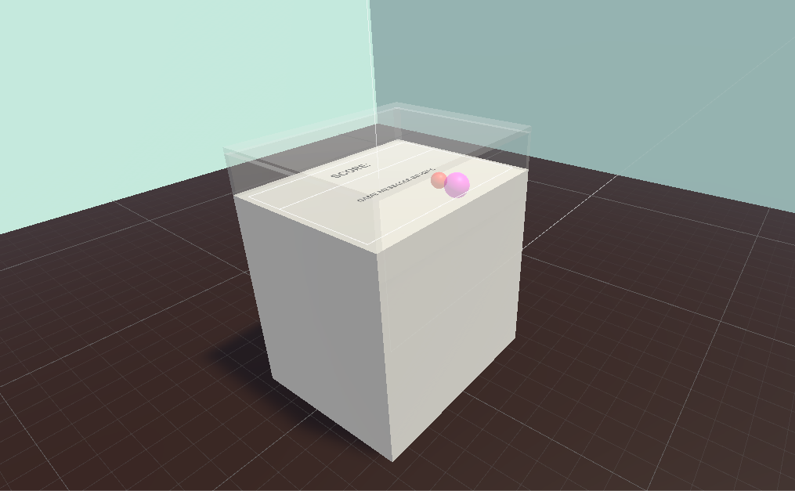
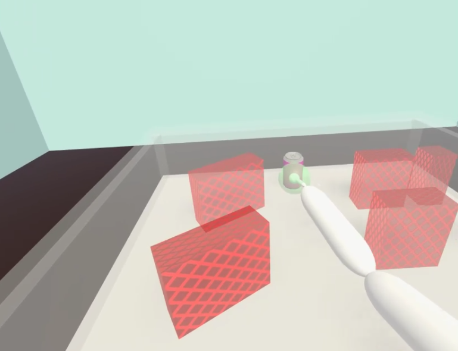

## Participants

Twenty-six participants (mean age = 34.76 years, sd = 11.23, range = 21.50 - 61.10; 24 right-handed, 2 left-handed; 16 female, 10 male) took part in the study. 

## Materials

The data was collected using a task developed using Unity (version 2018.2; Unity Technologies, 2018), SteamVR (Valve Corporation, 2019), and Unity Experiment Framework (Brookes, Warburton, Alghadier, Mon-Williams & Mushtaq, 2019). 
Participants wore a HTC Vive Pro virtual reality (VR) headset, used a Vive controller to interact with the virtual environment, and wore two HTC Vive trackers attached at the elbow and upper arm. 
The position and rotation of the hand, elbow and upper arm was sampled at 90Hz. The VR headset was calibrated using the built-in procedure that aligned the virtual floor to the real floor. 

## Procedure 

With the participant sat in a chair set to a comfortable height, the demonstrator placed the VR headset onto the participant's head and adjusted until the participant's vision of the scene was clear. 
The trackers were then attached to the elbow and upper arm using velcro straps. 

The virtual environment consisted of a virtual room (3m height, 5m width, 5m depth), with a table in the middle (0.73m height, 0.74m width, 0.6m depth), shown in the below image. 
The top of the table was surrounded by transparent screens of 0.02m thickness, with the front face open (giving an effective workspace of 0.13m height, 0.7m width, 0.58m depth). 
The width and depth of the workspace were chosen to ensure subjects would be able to cover the whole workspace without excessive reaching to reduce fatigue during the experiment. 

In the virtual environment, participants could see an abstract representation of their arm. 
The hand was visualised as a solid white sphere (diameter 0.025m), which interacted with the scene using Unity's physics engine and could push obstacles. 
Around this there was a semi-transparent sphere (diameter 0.075m), which was used to pick up objects in the scene. 
When participants were able to pick up objects in the scene, the colour turned orange, and when participants were actively holding an object it turned green. 
Picking up an object was done using the VR controller's trigger button, operated with the participant's index finger, and could only be done when the semi-transparent sphere was orange. 
If participants let go of the trigger whiole holding an object, it was released. 
A wrist joint was added at a fixed distance from the hand (+0.025m vertical, -0.14m depth, and +- 0.025m horizontal depending on handedness, in local coordinates), joined by a capsule shaped limb. 
The wrist, elbow and upper arm were linked to each other using two further capsule shaped limbs.
All limbs interacted with the scene using the physics engine. 

Prior to the experiment staerting, participants were asked to hold their their hand at a comfortable height to perform the reaching movements required. 
The demonstrator then pressed an on-screen button that aligned the start-point so the hand was located vertically central to the work space. 
Inside the work space were a start (0.05m diameter) and end point (0.075m diamater) that participants interacted with. 
The start point was located 0.1m and the end point 0.035m from the front of the table, and both were vertically and horizontally central to the work space. 

Participants began a trial by moving their hand to the start point. 
After a uniformly sampled delay between 300-600ms, rectangular obstacles appeared in front of a cylindrical target. 
Participants were instructed to interact with the scene, by either avoiding or moving obstacles, so that they could pick up the target and move it to the end point. 
An example of a participant retrieving the target is shown in the below image. 
Trials could be failed by any part of the arm (except the hand) interacting with an obstacle, if any moved object hit the edge of the workspace, if the target touched any obstacle, if any obstacle was knocked over, or if participants took more than 15 seconds to reach the obstacle or move the obstacle to the end point. 

The experiment was made up of 9 practice trials, 100 structured trials, and 30 unstructured trials. 
In the **practice and structured trials**, obstacles were organised into two rows, the first 0.245m and the second 0.405m from the front edge of the table respectively. 
Three obstacle sizes were used, all with 0.12m height and 0.05m depth, but widths of 0.05m, 0.1m, and 0.15m. 
The target (0.05m diameter, 0.085m height) was located 0.525m from the front edge, and placed horizontally central to the workspace. 
In the practice trials, two obstacle sizes were randomly selected for each row and placed at random locations horizontally. 
In the structured trials, each row consisted of all three obstacle sizes. 
In 70 of the structured trials, the obstacles were located horizontally at random locations. 
In the other 30 trials, hand designed trials tested different combinations of scenarios where the left, centre and right of the table were completely free on both of the rows, the first or second row, or none of the rows. 
The 100 structured trials were randomly shuffled after being generated, so each participant had a different order. 

In the **unstructured trials** the obstacles were not restricted to be organised in rows. 
Six obstacle, two of each obstacle size, were randomly placed in the scene, within an area of 0.63m width x 0.4m depth, starting 0.175m from the front of the table. 
The horizontal position of the target and start point was also randomly selected for each trial. 

## References

Brookes, J., Warburton, M., Alghadier, M., Mon-Williams, M., & Mushtaq, F. (2019). Studying human behavior with virtual reality: The Unity Experiment Framework. Behavior Research Methods. https://doi.org/10.3758/s13428-019-01242-0 

Unity Technologies. (2019). Unity. California, USA. Retrieved from: https://unity.com/

Valve Corporation. (2019). SteamVR. Washington, USA. Retrieved from: https://store.steampowered.com/steamvr 
